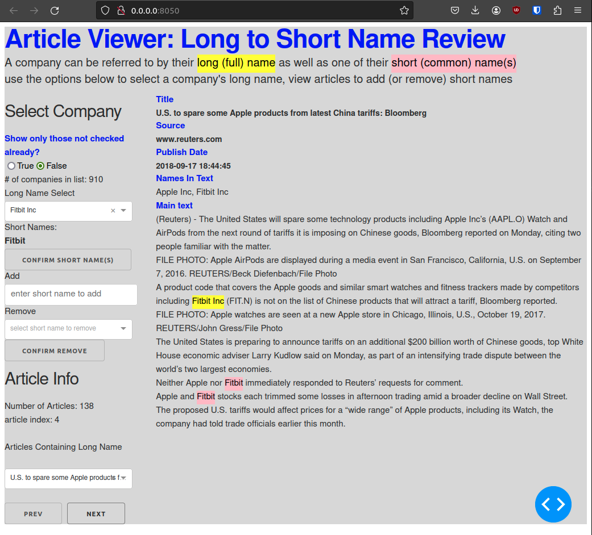
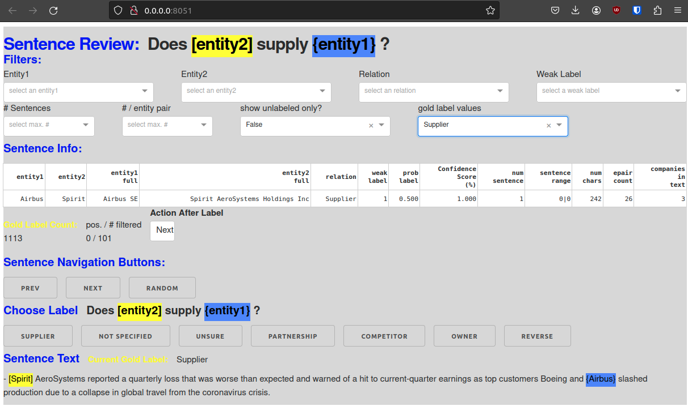

# Supply Chain Extraction from News Articles 

using an Large Language Model (DistilBERT), data programming and distance supervision 

This work was done as part of a project for a Statistical NLP course in 2022. 

A high-level overview can be found [here](https://ronaldbuddys.github.io/supply-chain-extract/Spotlight_Presentation.pdf)

## Database: MongoDB

requires access to a MongoDB server. for a quick start restore from 
a database [dump](https://drive.google.com/file/d/1YH6TcVo7klXb2AMOiFodi6HUfrrfWxV4/view?usp=sharing)

## Setup Virtual Environment

    # Create a virtual environment
    python3 -m venv venv
    
    # Activate the virtual environment
    source venv/bin/activate
    
    # Installing dependencies
    pip install -r requirements.txt

## News Articles: Common Crawl

#### Available Compressed News Articles — Updated Daily 
get list of warc (compressed file) of news articles
`aws s3 ls --recursive s3://commoncrawl/crawl-data/CC-NEWS/`

requires `AWS Command Line Interface` and access credentials. See: [AWS CLI User Guide](https://docs.aws.amazon.com/cli/latest/userguide/cli-chap-welcome.html)

given above, update available warc files

`python -m supply_chain_extract.common_crawl_warc_files`

#### Download Warc Files, Extract News Articles

`python -m supply_chain_extract.news_please`

#### Add Articles with Company Names Found in Knowledge Base

`python -m supply_chain_extract.add_articles_to_mongodb`

## Run Apps for Reviewing Content

#### Long to Short (Common) Name Mapping

Reuters articles may use more than one name to refer to a company,
a so called 'Long' name and one or more short names e.g. 'International Business Machines Corp' -> IBM

Company's a first identified by their Long name, using the Knowledge Base. 
Use the following dashboard to identify the short names

`python -m app.view_articles`

#### Golden Labelling

Review sentences containing entity pairs to create gold labels, to be used
in classification fine-tuning 

`python -m app.view_sentences`

### Overview of Distance supervision

TODO: add!

### Data Programming

TODO: add!

### Notebooks Used for Classification Fine-Tuning

TODO: add!
